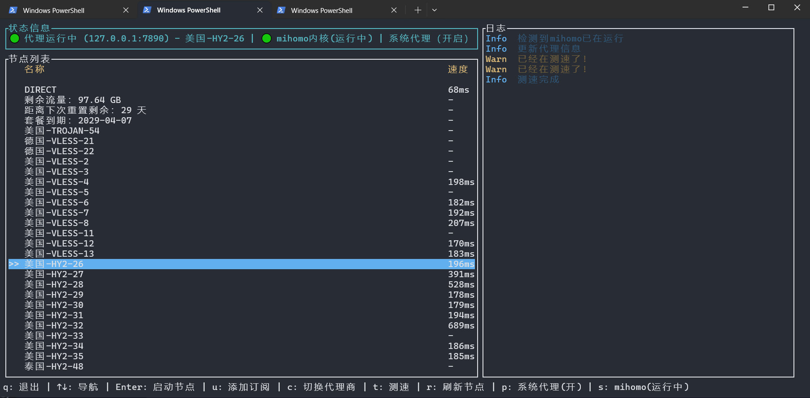

## 介绍

这是基于mihomo内核的tui。

目前只支持系统代理，tun模式后续再添加。

在windows上应该基本可用，linux上需要自己修改环境变量，然后source。

> 做这玩意的契机是，我主用的系统的nixos，不知道为什么会clash verge rev有时候会抽风，导入不了url，于是我打算自己玩mihomo内核。
>
> 但是发现自己解决不了linux的系统代理热切换。只能修改linux的系统代理，然后mihomo开了不关QWQ.

## 用法

首先，暂时还没有添加自动下载mihomo的方案，需要你自己下载，然后添加环境变量。

或者能找到启动路径，修改`./src/constants.rs`的静态变量：`pub const MIHOMO_EXE: &str = "mihomo-windows-amd64.exe";`

> 后续我会修改这一部分

然后运行`cargo run`执行或者`cargo build`打包二进制文件。

## 界面展示

1. windows中

## TODO

1. 添加tun模式。
2. 提供mihomo自动安装方案。
3. 添加后台启动（保存上一次的运行结果，命令启动，而不是一定要打开tui）
4. ~~mihomo的进程和tui解耦，关闭tui不关闭mihomo~~
5. 提供直连、规则等修改。
